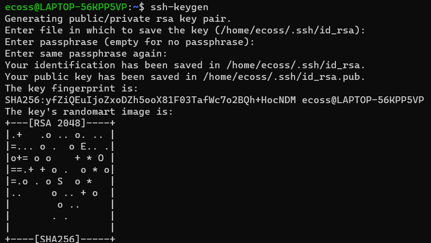

# Generar llaves de seguridad

Con esta llave no necesitaras usar nuevamente tu contraseña en los servidores que la contengan y mientras estes usando esa computadora.

Primero debes contar con una consola en lenguaje bash

- OS y linux ya tienen terminales con este lenguaje incorporado en su sistema
- Windows, necesitaras instalar una terminal, te recomiendo [MobaXterm](https://mobaxterm.mobatek.net/).


> [!NOTE]  
> Ya existe un manual con las informacion relacionado con este tema y los 
> diferentes sistemas operativos Linux, Windows y Mac OS X.
> Puedes dar click a este [link](https://eveliacoss.github.io/keygen/Manual_Keygen.html)

## Paso 1. Generar la llave en tu computadora

```
# Instalar ssh-keygen
sudo apt-get install ssh-keygen
# Ejecutarlo
ssh-keygen
```
Cuando ejecutes el programa te va a preguntar si quieres generar una frase, identificar y como quieres nombrar la llave. Si no quieres complicarte solo da 3 veces ENTER, hasta tener una pantalla como la siguiente:



Posteriormente, tendras una carpeta llamada `.ssh/`, entra en esa carpeta y tendras dos archivos, si no los renombraste tendran el nombre de `id_rsa`.

- `id_rsa` = llave local, no la vamos a usar. Tampoco la compartas.
- `id_rsa.pub` =  llave publica. La usaremos para copiarla en los servidores que usaremos.

```
# Para ver los archivos contenidos en esa carpeta
ls .ssh/
```

## Paso 2. Almacenar la llave en el servidor

Vamos a copiar la llave publica `id_rsa.pub` en el servidor. Recuerda que si estas dentro de la carpeta `.ssh` en tu computadora, solo pondrias el nombre del archivo `id_rsa.pub`. 

Modifica en el siguiente ejemplo el `usuario` y la ruta del servidor. El archivo debe almacenarse dentro de la carpeta `.ssh` en el servidor y ademas con esta instruccion estamos creando una nueva carpeta llamada `lap`. 

```
scp .ssh/id_rsa.pub usuario@ruta.servidor:/home/usuario/.ssh/lap
```

Posteriormente, entra al servidor y ubicate en la carpeta `.ssh` que debe encontrarse en tu HOME.

```
# moverse a la carpeta
cd .ssh/
# ver los archivos contenidos dentro de la carpeta
ls
```

Vamos a unir la informacion de la llave publica `id_rsa.pub` con las llaves ya existentes en el servidor relacionadas con tu usuario, llamandose ek archivo `authorized_keys`. Generamos un archivo llamado `keys` como una buena practica para no sobreescribir algo que no deseamos.

```
cat authorized_keys lap/id_rsa.pub > keys
```

Ahora que estamos seguros de no haber modificado nada, podemos sustituir el archivo `authorized_keys` con el nuevo archivo `keys`. 

```
mv keys authorized_keys
```

Listo ⭐. Ahora solo necesitas entrar al servidor usando:

```
ssh usuario@ruta.servidor
```

## Paso 3. Generar un alias en bashrc (opcional)

- En linux y en Windows el archivo se llama `bashrc`
- En iOS o Mac se llama `bash_profile`

Vamos a crear un `alias` para que cada que tu tecles una palabra entres al servidor sin problemas y sin usar tu contraseña.

```
alias unam="ssh usuario@ruta.servidor"
```

Despues de modificar el archivo `bashrc`, debes volver a cargarlo usando `source .bashrc`.

Si usas MobaXTerm, te dejo esta guia del uso de `bashrc`, click en el [link](https://codetryout.com/mobaxterm-local-terminal-bashrc/). 

-----------------
Tutorial generado con amor 💜


